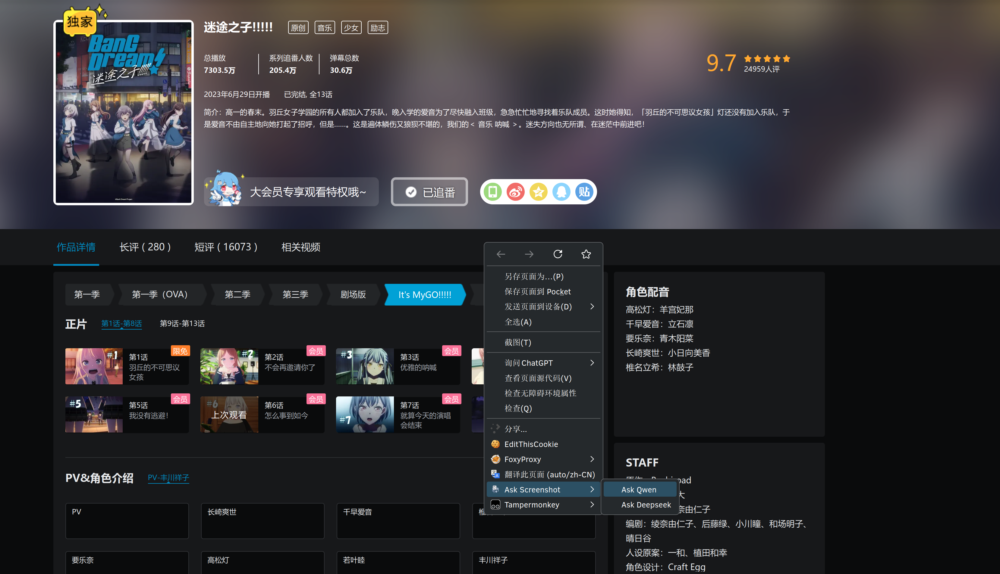
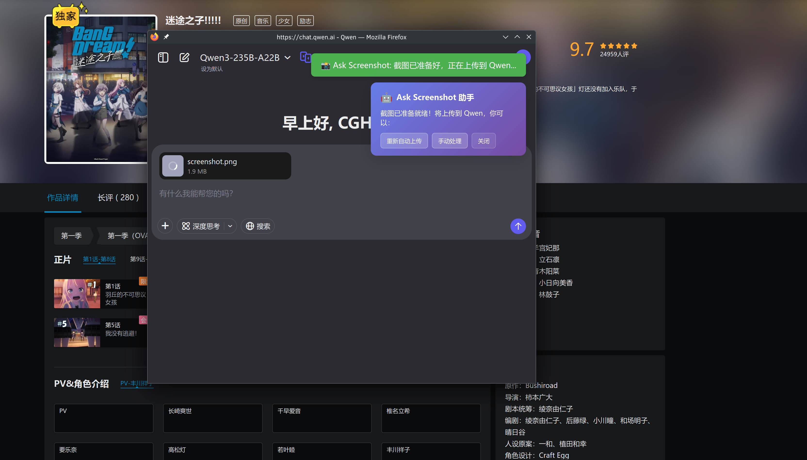

# Ask Screenshot 浏览器插件

🤖 一个便捷的浏览器插件，可以截图并自动上传到 AI 网站（Qwen/Deepseek）进行提问。

本项目受到polywock的[ask-screenshot](https://github.com/polywock/ask-screenshot)启发，主要面向中国大陆用户。

## 🚀 功能特性

- 右键菜单快速截图（支持 Ask Qwen 和 Ask Deepseek）
- 可视化区域选择
- 自动打开对应的 AI 网站
- 智能图片上传到 Qwen 或 Deepseek
- 多平台适配和错误处理
- 简体中文界面

## 🎯 使用方法

1. **启动截图**：在任意网页右键 → 选择 "Ask Qwen" 或 "Ask Deepseek"
2. **选择区域**：拖拽鼠标选择要截图的区域
3. **确认截图**：点击确认按钮
4. **自动跳转**：插件会自动打开对应的模型网站
5. **上传图片**：在 AI 页面中自动或手动上传截图

## 📋 权限说明

插件需要以下权限：

- `contextMenus`：创建右键菜单
- `activeTab`：访问当前标签页
- `tabs`：获取标签页信息
- `storage`：存储截图数据
- `<all_urls>`：在所有网站注入脚本
- `screenshots`：截图功能

## ⚠️ 注意事项

1. 确保浏览器允许插件访问所有网站
2. 某些特殊页面（如 `chrome://` 页面）无法截图
3. 如果自动上传失败，会提供手动下载选项

## 🔍 功能预览

